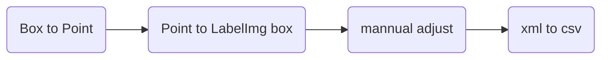

# eos_cloud

This is an end-to-end demonstration of how to create and deploy a computer vision model on Google Cloud.

In this process, I will reuse the data form one of my previous projects. I will process the data to match the request format of Google Cloud's AutoML Vision, first.Then, I will leverage the AutoML Vision to train an "object detection" model on these precessed data. Next, I will deploy the model on Google Cloud's Kubernetes Engine(GKE). Finally, I will use Cloud Run to implement a stateless website to show how the model work.

Now, please let me guide you to walk through the journey.
We'll have 5 episodes of the story. They are :

1. The way I used to play

2. Start again

3. Magic -- AutoML Vision

4. Lift and serve the model

5. Create a stateless Web-APP

6. Deploy in one way or another way

## The way I used to play

It's a long hot summer night. I was sitting in front of my desktop trying to adjust the parameter of my little watershed algorithm so that it can separate the background and my interest of regions -- Eosinophils.

This project was set up by Data and Computer Science department, Sun Yat-sen University and Sun Yat-sen memorial hospital. It aims to build a framework that could be used to train a model to "learn" any type of cells they want to detect. And the first type they chose is the Eosinophils, which is important in clinical testing and somewhat easy to be recognized.

Two other medical students and I were invited to try the water. The model was supposed to be used in personal computers, like laptops. We started with 3 labelled slides. On each of the slides, there are about 100 - 200 Eosinophils.

I had read some articles about object detection. I try to use Google's object detection API in Tensorflow to train a model, which is based on faster-RCNN architecture. It failed, of course, simply because the number of images is too low. Also, I realized the model of faster-RCNN that is one hundred more MB is quite large, and it is not possible to run on ordinary laptops fast. Luckily, Kaggel has finished a competition about cell detections at that moment. From this competition, I met a model architecture, U-net. This architecture was successfully used in the Kaggle 2018 competition by many teams. Moreover, it's fast, relatively small and powerful, which fitted our users' needs. Still, 3 slides were not enough.

So the first thing was to get enough data. We decided to train a CNN model, which is easy to create, to help us label slides. First, we used watershed and other algorithms to segment cell-like "tiles" from the slides. Then, we used these small images to train a classification CNN model. The model worked somewhat well. And we used it to classify the cell-like object on unlabeled slides, an indirect way to label slides. After that, we just corrected the wrong label and we can get labelled slides super quickly because many cells have been labelled by the CNN model. The result like the below. The boxed are the labels made by the model, and we used green points to "correct" its labels.

After we have 40 to 50 slides, we began to use U-net as the architecture for our next model.However, U-net can only generate a possibility hot map and needs this kind of map to train. Remember what the users asked is the count of cells, not something else. So the U-net model cannot work alone and we had to design a pipeline to integrate the U-net model. First, we cropped each large slide into small images. Then, we used watershed algorithms to "transform" our previous label as "masks", so that U-net can be trained. When it comes to prediction, we segmented the slide for prediction into small images first; next, we used U-net to generate masks; then masks were combined into a large mask to match the original slide. Finally, we use watershed and other algorithms to detect the region of cells. Because after U-net's processing, the masks will show the interest of regions as white and the background as black. It's easy for the watershed to separate the cells from this pure background. The mask and its final result are shown below. Then, we had done!

For more details, look at in [here](https://github.com/Moo-YewTsing/EOS-Detection)

## Start again

It's a complex process, I have to admit. And the tuning process for the watershed algorithms was an unpredictable and trial-and-error experiment, or say torture. Due to the different sizes and overlapping ways of cells, it's hard to manually adjust the parameters to fit all situations. Also, because the watershed algorithm has the final say. The ceiling of the model's performance is restricted by this old-fashion algorithm. As a result, even though the U-net works well, the overall precision is 0.81 and the recall is just 0.72.

From Coursera, I knew the AutoML Vision of Google Cloud is amazing. So I decided to have a try. The data to train an object detection, it needs, are images and label boxes' coordinates. However, what I have are slides with points and boxes. I tried to use the watershed algorithm again to "transform" these labels to coordinates. The result is bad, which has a lot of repeating coordinates. It's not a problem to prepare data for the U-net model, because the data it feeds on are masks, which will not be influenced by repeating. However, for this end-to-end prediction model, it will directly learn from the bad data. As a result, it will learn the repeating labels are different and cause serious over-counting.

I found the size of the cells is similar. Also, the loss function of the object detection model is based on [mAP](https://medium.com/@jonathan_hui/map-mean-average-precision-for-object-detection-45c121a31173). It means the location and coverage of the label box don't need to be exactly accurate. So, I decided to re-label all the labelled slides, whether they are labelled by yellow points or black boxes, by green points. Then, I simply calculated a box with each point as the middle, and with a randomly normal distributed change in line length. I saved these box label data into XML files so that I can use [LabelImg](https://github.com/tzutalin/labelImg) to check and do a manual adjustment. Always, junk in junk out. Finally, I convert these XML files into CSV files and change the line absolute length (pixel) into relative length, as required by AutoML Vision.

## Magic -- AutoML Vision

The architecture of the vision models is in secret. Still from the model's respond payload, I saw the AutoML Vision will resize the images into 512 * 512 pixels. Also, as a rule of thumb, to get a smaller model, every input instance should be smaller. So I divided each 1920 * 1440 slides into four 960 * 720 images and change their labels value correspondingly.

Locally, I randomly separate the whole data into the training dataset and the testing dataset. Then, the training dataset and its label CSV were uploaded to Cloud Storage. I measured the different performances between Cloud Served Model (the big one) and Edge Model (the small one) in varying settings. Cloud Served Model cannot be extracted from the Cloud, so I cannot adjust the threshold nor move the model to other places. The comparison is as below.

The edge model in the "Mobile High Accuracy" type performs well and can be used in other places. It's a good option to leverage the expertise of Google AI. So, I extracted it out and prepare to deploy it.

## Lift and serve the model

Here come at least 3 solutions.

First, simply click the "Deploy Model", and GCP will handle all the process and network tuning related to deployment. It's auto-scale up as well. However, one downside is that it'll help to filter the result and then, only the result with possibilities larger than 0.5 will be sent back from the server. The price is $0.0791 per node per hour, which is higher than the following options.

Second, you can deploy the model by yourself, and using docker to make the model service containerized is the option. It's super fast to write a Dockerfile based on [TensorFlow Serving](https://github.com/tensorflow/serving) and use [Google Build](https://cloud.google.com/cloud-build/) to wrap the model into a container and deploy to the places you want. For example, you can choose Kubernetes, "a managed, production-ready environment for deploying containerized applications". A "cluster" with only one small machine type is enough for this model, which has 0.5 CPUs and 1.7GB RAM, costing only $0.0257 per hour.

Last, to achieve maximum DIY, you can choose to use a VM and do what you want. But, in this case, you have to set the networking forwarding, IP, safety rules etc.. 

Here I chose the second solution and use the power of Kubernetes. I changed part of the Dockerfile of TensorFlow Serving: add a line to copy the model to the container and make the REST port follow the container's environment variables. Then, I used Cloud Build to make a container image based on the Dockerfile and it automaticly submitted to the Container Registry, "a single place to manage Docker images", which is on the Cloud Storage, so that the other service can use this image immediately.

After creating a cluster as the description above, I deploy the container to the cluster using Kubernetes. On the cluster, Kubernetes create 2 pods for running model and 1 pod for network loading and exporting REST API. Then, this microserver for eos detection was deployed and can be used anywhere.

## Create a stateless Web-APP

To show the performance of this model, I make a Web-app adapting form two Github repositories. It is built by Next.js. I'm not a Web-app developer, so this app is almost just a copy-paste-change product. Under the hood, it reads the local image, converts it into Base64 string in JSON and calls the REST API of the model served by Kubernetes. Also, because this Web-app can be containerized, I can use Kubernetes as well. Here, for the propose of demostation and saving money, I use Cloud Run, "a managed compute platform that automatically scales your stateless containers."

Sounds like Kubernetes. Yes, from my understanding, it's like abstracting Kubernetes and all you need to do is to provide a container. I think my model can be served in this way as well. Since Cloud Run will bill you by the request, it can idle on the Cloud and cost 0. Yet, the Kubernetes is charged on the running hour of the clusters, so it's like a flat price. If you want to listen to the call 24 hours a day, you have to pay 24 hours no matter how many requests your server handles. For a project aiming to show a prototype can work, i.e. only 1 or 2 request exist, Cloud Run will be much cheaper, maybe just stay at the free tier.

Here is the demo.

## Delopy in one way or another way

Here is the whole architecture. 

Due to the time limitation, I didn't add a necessary layer between the Web-app and the model server. That is Cloud Functions "a serverless compute platform that makes it easy to run and scale your code in the cloud". I should use it to hide my model server API and as an interface for future additions. Here, let us assume there is a Cloud Functions.

And because every part is a microserver, you can change one server or add more servers without influencing the other parts. For example, I want to add authentication. I can use Cloud Function to add a layer between the Web-app and the Cloud Functions or simply add some code in Cloud Functions. Meanwhile, use another container as a database to provide authentication information. And then it's done.

Sharing Interesting Observations and sweet spots from Google Cloud Next 2019.
